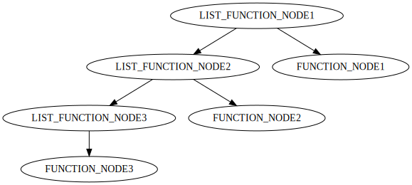

# Compilateur - Rapport de Projet

Magnoli Mathieu MI 
Bittel  Axel    MI

## Introduction

Dans le cadre de ce projet, nous avons développé un compilateur qui effectue la traduction d'un sous-code du langage C vers une représentation intermédiaire visualisable en DOT (Graphviz). Cette expérience nous a permis d'explorer les aspects pratiques de la compilation, tout en consolidant nos compétences en travail d'équipe et en mettant en pratique les concepts théoriques abordés en cours. Nous avons également été confrontés à diverses difficultés techniques.

## Organisation du travail

Tout au long du projet, nous avons travaillé en binôme, ce qui nous a permis de tirer parti de nos compétences complémentaires : Axel => pratique, Mathieu => théorique.

Pour faciliter notre travail d'équipe, nous avons utilisé trois outils essentiels :

1. Trello - Gestion des tâches :
Nous avons utilisé Trello comme outil de gestion de projet pour organiser et suivre nos tâches. Nous avons créé des listes représentant différentes phases du projet, telles que l'analyse lexicale, l'analyse syntaxique, analyse sémentique, etc. Nous avons pu suivre l'avancement de notre binome sans devoir se réunir à chaque fois.

2. Git - Collaboration et versionnage :
Nous avons utilisé Git comme système de contrôle de version pour gérer notre code source. Nous avons créé un dépôt Git commun sur GitHub. Cela nous a permis de travailler simultanément sur le code. 

3. Docker Fedora - Environnement uniforme :
Afin de garantir une cohérence dans nos environnements de développement, nous avons utilisé Docker avec une image Fedora. Cela nous a permis de travailler sur des machines différentes tout en étant assurés d'utiliser le même système d'exploitation et les mêmes dépendances.

## Choix de developpement

Dans le but de simplifier l'implémentation du compilateur, nous avons choisi d'utiliser une structure d'arbre abstrait binaire. Cela nous a permis de bénéficier d'une représentation plus concise et plus facile à manipuler que la gestion d'arbres à n fils. En utilisant un arbre binaire, nous avons pu simplifier les algorithmes de parcours, de génération de code et d'optimisation.
Cependant cela à crée des noeuds intermédiaires.  
Exemple sur la facon de stocker l'ensemble des noeuds des fonctions : 
 
Nous avons donc dus durant la traduction en DOT ignorer ces noeuds intermédiaires. 

Ce projet de compilation nous a offert une expérience précieuse dans le développement d'un compilateur fonctionnel. 
La seul déception est de ne pas avoir fais un compilteur complet vers un langage assembleur.